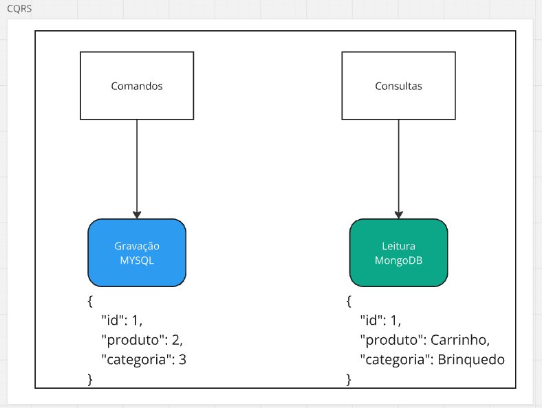

# Event Driven Architecture (Arquitetura baseada em eventos)

O curso aborda sobre arquitetura baseada em eventos.

## Sumário

1. [Iniciando com eventos](#iniciando-com-eventos)
2. [Event Notification](#event-notification)
3. [Event Carried State Transfer](#event-carried-state-transfer)
4. [Event sourcing](#event-sourcing)
5. [Event Colaboration](#event-colaboration)
6. [Entendendo CQRS](#entendendo-cqrs)
7. [CQRS e sepração física de dados](#cqrs-e-sepração-física-de-dados)
8. [Event Sourcing vs Command Sourcing](#event-sourcing-vs-command-sourcing)
9. [Como implementar CQRS](#como-implementar-cqrs)


### iniciando-com-eventos

- Arquitetura baseada em eventos é uma arquitetura que espera eventos ou coisas que aconteceram em um sistema para tomar uma decisão.
- Normalmente eventos são efeitos colaterais de um sistema, podem ser coisas extremamente simples, ou extremamente complexas.
- Temos tipos diferentes de eventos.

#### Eventos

- Situações que ocorreram no passado.
- Normalmente deixa efeitos colaterais. Ex: Porta do carro abriu -> devo Ligar a luz interna.
- Trabalhar de forma internalizada no software, ou externalizada.
    - Internalizada: é escutado por componentes que estão dentro do mesmo sistema.
    - Externalizada: Expor fora do nosso escopo local, para sistema de fora.
- Domain Events (Eventos de domínio): Mudança no estado interno da aplicação / regra de negócio -> ex: Agregados.

### Event Notification

Quando um sistema quer notificar outro sistema ou componente de que algo mudou. Forma curta de comunicação. 

Ex: 
```json
{
    "pedido": 1, 
    "status": "aprovado"
}
```

Note que não sabemos detalhes do pedido, ou qual é o produto. Isso é útil em cenários onde temos vários e vários microserviços e precisamos notificar outro serviço de algo que mudou, sem a necessidade de enviar um json gigante contendo toda a informação, é muito complexo, custoso, logo com o event notification mandamos apenas os detalhes que nos interessam.

### Event Carried State Transfer

É um formato mais completo para trafegar informações. Quando trabalhamos nesse formato não utilizamos um sistema padrão de mensageria, esses sistemas de mensageria normalmente notificam um sistema de um lado para o outro, mas eventualmente eu não quero notificar outro sistema, mas sim mandar o dado em si.

Normalmente quando temos dados muito grandes ou dados muito grandes, ou dados que fazem sentido dentro de um escopo global, nos temos stram de dados, e esse stream de dados. 

Sistemas de mensageria nos permitem trafegar dados maiores, porém necessariamente eles não foram feitos para isso, pois quando trabalhamos com stream de dados normalmente gravamos a informação.

Então o `"Stream de dados"` traz o dado, e não a mudança ou uma simples notificação. Por exemplo:

```json
{
    "pedido": 1,
    "produtos": [{}],
    "valor": 10.00,
    "tax": "1%",
    "comprador": "André"
}
```

A ideia de trazer os dados completos, existe por várias razões, por exemplo:
- Imagine que pegando os dados completos eu posso inseri-lós em outro banco de dados.
- Posso mandar para outro sistema que vai usar a maioria das informações.
- As vezes só o id e status não nos serve para outros contexto.

Por outro lado temos também:
- Um aumento de custo, devido a quantidade de dados.
- Será necessário um sistema de stram mais robusto.
- Trafegamos mais dados.
- Os sistema trabalham mais para parsear os dados.

### Event sourcing

É uma forma de capturarmos os eventos que acontecem em um determinado sistema e armazená-los em um banco de dados, que normalmente pode ser um `times series database`, ou seja, um banco de dados focado em uma linha do tempo.

Isso é muito útil, pois conseguimos ao longo do tempo, pegar tudo que aconteceu dentro de um determinado sistema, isso nos ajuda muito. Por exemplo:

Pense na sua conta bancária, você tem um saldo. Mas como você sabe o seu saldo? O saldo atual é a soma de tudo que aconteceu no passado em sua conta, por exemplo, saques, depositos, transferências etc. Então para chegarmos exatamente no valor atual do nosso saldo é necessário o registro de tudo que aconteceu em sua conta.

Isso é muito interessante, pois se qualquer informação for perdida, nunca conseguiremos chegar ao nosso saldo atual.

Então quando trabalhamos com o event sourcing, temos todo o histórico de tudo que aconteceu no sistema, e se precisarmos podemos dar um `"replay"` e reprocessar todas as informações para chegarmos ao mesmo resultado. Logo, veja a importância de um banco de dados com todos os eventos registrados.

Em algumas empresas isso não é uma opção, ou seja, temos que ter todas essas informações guardadas. 

Existem até bancos de dados que não permitem ações como `update` e `delete`, então quando um dados precisa ser alterado, ele cria um novo registro e faz a alteração, mantendo a versão anterior, mantendo uma auditoria.

Existem várias estratégias para trabalhar com os dados, já que se tratam de uma grande quantidade, por exemplo, podemos manter os dados mais atuais em um storage, e os dados muito antigos podemos guardá-los em um S3 por exemplo que é mais barato.

### event-colaboration

Quando temos um sitema ou um set de sistema que para cada coisa que acontece ele gera todos os eventos, qualquer mudança que ocorre um evento é gerado.

Parece muito com o que vimos no tópico anterior mas acredite não é.

#### Método tradicional

Imagine que você quer comprar um produto

Veja abaixo:

- André comprou o produto 
    - André notifica estoque do produto comprado
    - André notifica catálogo do produto comprado

Na realidade não não é o André que notifica, mas o que acontece é que um sistema notifica o outro e assim por diante:

- André comprou um produto -> Estoque do produto comprado -> Muda o catálogo -> emite nota -> Separação ...

Então embora as coisas funcionam de forma assíncrona, após uma ação várias coisas acontecem após, que é o que estamos acostumados

#### Com o event colaboration

Neste método todos os sistemas em todo momento geram todos os eventos, essa é a diferença. Por exemplo:

- André comprou
- Estoque mudou
- Cor do produto mudou
- A nota foi emitida
- Erro aconteceu
- Nota foi emitida
- Produto mudou a descrição
- ...

Veja só, toda mudança interna, toda mudança de estado, toda mundança em nosso agregado geram eventos, em 100% dos tempos.

Com o Event Colaboration tudo em todo momento está gerando eventos, e isso é muito positivo, pois posso ouvir várias coisas que estão acontecendo no meu sistema. Neste caso não é necessário esperar por algo, pois, eu parto do princípio que eu ja tenho determinada informação.

O artigo abaixo nos mostra exatamente isso:

https://martinfowler.com/eaaDev/EventCollaboration.html

Note que interessante 

NO exemplo um temos uma ação que diz, estou saindo, logo na sequência temos um evento para saber a temperatura, e de acordo com a temperatura neste exemplo temos de levar a jaqueta.


Já neste exemplo, os eventos são enviados a todo momento, eu não preciso esperar uma resposta me indicando qual a temperatura, pois toda vez que a temperatura muda, um evento será gerado notificando todo mundo, como podemos ver na imagem abaixo:


Sempre partiremos do principio que temos todas as informações para tomar uma decisão.

Mas claro, é bem complexo.

### Entendendo CQRS

Agora veremos sobre o `CQRS Command Query Resposability Segregation` + `Event Sourcing`.

Antes disso temos também algo que chamamos de CQS a principal diferença entre os dois termos é o nível de granularidade.

A ideia básica do CQRS é separar Comando de consulta.

#### Comando VS Consulta

#### Comando

É uma intenção de mudança do usuário. (Ex: Criar um produto). O comando apenas muda algo, não tem retorno, cria um produto e pronto. 

Aqui podemos pensar que nossa aplicação tem o domínio com as entidades, regras de negócio, etc. 

#### Consulta

Para entendermos melhor a vantagem da separação entre comando e consulta, vamos pensar novamente na nossa aplicação.

Normalmente quando falamos em DDD, ou hexagonal architecture temos nossa camada de domínio que contém as regras de negócio, as entidades o nosso agregado.

Temos também a nossa camada de infra, onde temos os nosso repositórios. Toda vez que precisamos fazer uma consulta, seguimos alguns passos:

- Requisição get para consulta
- Repositorio pega os dados 
- Devemos idratar as nossas entidades, fazendo diversos joins.
- Entre outros operações.

Quando fazemos todos esses passos a coisa fica complexa, não é simples reunir todas as informações ao usuário, são necessárias muitas etapas até que a consulta retorne algo.

É aqui que a separação fica interessante, pois neste caso, eu quero estes dados e pronto. Não importa as entidades, as regras de negócio, eu só quero os meus pedidos. Dessa forma fica muito mais simples uma consuta, do que eu ter que idratar todo o meu domínio. 

Neste parte de consulta eu quero focar apenas nos dados, no retorno, e não no domínio, nas regras de domínio, sem necessidade de complexidade.

Os repositórios serão mais simples.

### CQRS e sepração física de dados

Além de separamos os Comandos das consultas, também podemos separar os bancos de dados, é isso mesmo, podemos ter um banco de escrita e outro de leitura.

Eu posso salvar os dados no banco de escrita, de uma forma e no banco de leitura de outra forma.

Veja na imagem abaixo, no banco de gravação temos o `id: 1, produto: 2 e categoria: 3`, note que eu não sei o que é o produto 2, nem o que é a categoria 3.
Já no banco de leitura eu posso salvar algo como `id: 1, produto: Carrinho, categoria: Brinquedo`. Aqui eu ja tenho os dados materializados, ou seja, eu não preciso ficar batendo cabeça para saber o que é um produto 2, ou uma categoria 3, e aqui as consultas serão mais rápidas, pois eu não preciso ficar realizando vários joins para saber o que um id representa.

Então imagine ainda que temos um banco de dados MYSQl para gravação, e um NOSQL, no caso o mongo para leitura, ou vice versa.



### Event Sourcing vs Command Sourcing

Para o criado do CQRS greg Yang o CQRS anda junto com o Event Sourcing.

Muitas vezes a estrutura dos dados estão diferentes no banco de gravação e no banco de leitura, e isso pode gerar algumas perguntas como: 

- No momento da gravação, eu salvo nos dois bancos ao mesmo tempo?
- Devo ter um sistema para realizar a gravação no banco que contém os dados materializados?

Vamos pensar:

Se todos os Comandos geram efeitos colaterais (eventos) e o event sourcing nós permite receber todos os eventos, então eu posso fazer um playback, ou seja, eu pego os eventos e salvo no banco de leitura no formato que eu desejo.

Neste exemplo, vemos que o event Sourcing é mais do que necessário para trabalharmos com o CQRS. 

Em um caso onde vamos usar apenas um banco de dados, por exemplo o MYSQL, tanto para Gravação como para Leitura, podemos ter alguns problemas para realizar a leitura dos dados como, diversos joins, lentidão em consultas, isso tudo deve ser levado em conta.

É muito comum quando alguém fala de CQRS mencionar também o Event Sourcing.

Então juntando o `CQRS + Event Sourcing` temos algo como:


Além disso temos ainda um outro modelo mencionado por Greg yang em uma entrevista, onde ele explica que podemos ter além do CQRS + o Event Sourcing o Command Sourcing.

Os seja neste caso temos todos os comandos, ou seja, eu posso fazer também o playback de todos os meus comandos na minha aplicação.

Vamos la:

O Event Sourcing é o resultado de um evento que foi gerado, e esse resultado é o processamento de algo que aconteceu, e o processamento de algo que aconteceu, aconteceu um um momento do tempo, em uma linha do tempo.

No Event Sourcing eu tenho um resultado baseado em eventos que aconteceram, mas eu não tenho no event Sourcing quais forams os comandos executados para eu ter esse resultado.

Então além disso eu posso ter armazenados os comandos de algo que aconteceu. Neste caso eu posso executar os comando novamente e ver o resultado.

Imaginque um cenário onde foram executados alguns comandos a 20 anos atrás com uma taxa de 1% que gerou o resultado X, a atualmente eu rodei os comando novamente com uma taxa de 3%. Observe o poder que temos nas mãos, podemos comparar os resultados executando exatamente os mesmos passos de 20 anos atrás.

### Como implementar CQRS

- Domain
    - Commands
        - UseCase
        - Repository


NO lado da consulta, não precisamos seguir fielmente o domínio, podemos ter nossas views materializadas.

Consultas
    - UseCases: Pode ser meu controller para evitar complexidade?
    - DAOs
